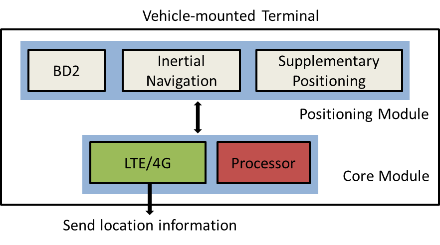

Global Flow Optimum Route Planning Method Based on Payment Policy
=========================================================

## Abstract

Nowadays traffic jam problem is increasingly worse and as a result becomes one of the major bottleneck that restrict the city development. ITS (Intelligent Transportation System) is proposed in order to deal with it which generally combines computer science, information system, communication and control technology. Howerver, many cities in the world has become so crowded that almost no route planning method could effect well enough. In this article, we propose a kind of payment policy to meet with this challenge. Besides, we design a concept of similarity between graphs to reduce computing complexity and a thought that realize global optimal road network if considering the tanglement as a result of traditional shortest-path algorithm.

## Keywords

payment policy, similarity between graphs, global optimal road network

## Introduction

The amount of automotive vehicle is increasing sharply. According to statistics, the number of automotive vehicle in China had reached 120 million by the end of 2012 and would reach 200 million by 2020 which is predicted by Ministry of Industry and Information Technology of the People's Republic of China. The vast number of vehicle in city not only worsens the traffic quality and efficiency but also increases time and money cost which leads to more serious traffic accident, traffic jam and environment pollution. The traffic problem has become one of the major bottleneck that restrict the city development[@Qiao2011].

Traffic problem heads from the imbalance of supply and demands relations: the demands for road resources is always larger than supply[@Srivastava2011]. As to city managers, approaches in two aspects could be taken into consideration. The first is to build roads and other infrastructure such as  suburban. The second is to restrict transportation useage intelligently. The first approach seems that it will effect very well as a fundamental method. But actually as to morden and mature cities nowadays, it will be always impossible since that cities today are too crowded and tangle to extend and build roads. Consequently the second method would be relatively better. 

By studying basic traffic theory, ITS (Intelligent Transportation System) is proposed to generally combines computer science, information system, communication and control technology and apply them to the whole traffic management system[@Dimitrakopoulos2010]. As is well known, ITS is the best way to solve traffic problems including but not limited to traffic jam, worsening transportation quality and efficiency and pollutions as a result.

One of the most important technology in ITS is the intelligentization of traffic guidance system. A typical intelligent traffic guidance flow can be described like this: satellites or other equipment collect positions of probe vehicles and send them to the server through communication network, then the server gets traffic information via analysis and in addition return guidance information to the drivers[@Manolopoulos2010].

figure or not? Display the general pic for ITS

However, current traffic guidace system doesn't seem to work well enough. Firstly, as to some metropolises, almost every street is so crowded that traffic guidance strategies cannot take effect. Furthermore, suppose that a driver got a guidance information in which he should abandon planned route, and drove from another route to the destination. Howerver, the driver might not mind the time he could saved or the saved time is lower than what he expected. As a result he would follow his original plan, which make the guidance system lost its meaning. The payment policy is proposed to meet with this trouble which could guide transportation demands from private cars to public transport means. Besides that, if the guidance information change the road situation from street A crowded and street B unimpeded to street A unimpeded and street B crowded, it must be meaningless. In other words, we need to take global optimum into account when we design the route planning algorithms. Finally, basic improvement is proposed to help reduce computing complexity.

## Overview of Intergreted System

We proposed a kind of architecture which is shown in figure \ref{general_system}  to serve as an intelligent traffic system. This system is divided into three parts: the client side, internet and the server side. In the client side, the vehicle-mounted terminal would send location infomation to the server every once in a while and the smart phone (which may be replaced by vehicle-mounted terminal) would send a request for guidance infomation and receive it on the other hand. In the server side, our server is designed to implement the following functions: real-time traffic analysis, valuation module, route planning algorithms and guidance infomation digitalizing.

As to the vehicle-mounted terminal, we decide to collect the probe vihicles' position with the help of BD-2, inertial navigation module and supplementary module. BeiDou is Chinese satellite navigation system and was updated to BeiDou-2 (BD2) in 2007. BD-2 system is able to provide basic positioning service in China and the surrounding area now and is designed to gradually cover the earth. It has bee tested that BD-2 performed better than GPS most of time in Chinese mainland in the eyes of visibility, stability and some other aspects[@Chen2010].

The vehicle-mounted terminal is designed to communicate with the server through LTE/4G which will become the most popular communication method in the future due to its better quality, speed and stability.

## Payment Policy

Considering directed graphs $G=(V,E)$ with $n$ nodes and $m=\Theta (n)$ edges. An edge $(u,v)$ has a nonnegative weight $w(u,v)$. A shortest-path query between a source node $s$ and a target node $t$ asks for the minimum weight $d(s, t)$ of any path from $s$ to $t$. In most route planning practise, the shortest-path algorithm regard the distance as edge weight. 

In our project, we decide to develop shortest-path algorithm which takes price as the edge weight. As shown in figure \ref{pricecontrol}, the traffic jam status is identified with colors. The green color means the road is open or unimpeded (② and ④); The yellow color means the traffic is a little heavy (③); The red color means that traffic is very heavy (①). 

Suppose that in the unimpeded road each car would cost 1 unit per kilometer which is writtern for $1u$; In the a little heavy road the cost is $3u/km$ and in the very heavy road it is $8u/km$. There are two schemes for one to dirve from A to B: the first is driving alone ① which will cost the driver $40u$ ($5km\times 8u/km$) and the second is driving alone ②③④ which will cost $25u$ ($5\times1+5\times3+5\times1$). Obviously, if we take reasonable payment policy, drivers would automatically keep away from the heavy road without traffic guidance (But actually traffic guidance is still a necessity considering many other issues).

In our proposal, the payment per unit distance  $Pay$ is related to the section of a very street ($sect$), the moment of a very day ($mom$), traffic jam situation ($jam$) and other special issues ($spec$) such as road reconstrution, temporary large-scale activities or some kind of emergencies. Thus the payment for each unit distance $Pay$ could be described as:
$$
Pay=f(sect, mom, jam, spec)
$$

We can simplify these conditions by classifying and grading them. For the first version, we classify those conditions into three levels--good, medium and bad. In this case, the payment for each unit distance $Pay$ could be calculated like below:
$$
Pay=sect \cdot mom \cdot jam + spec
$$
in which $sect$ represents the section grade of street, $mom$ represents the moment grade, $jam$ represents traffic jam grade and $spec$ represents the special issues grade.

Whether this payment policy would be adopted or not is a administrative and  economic problem. In addition, the payment and distribution policies will definetely raise many calls in question. However, the policy is actually benefical to improving nowadays traffic jam problems.

## Global Flow Optimum

With payment policy, drivers are guided from heavy roads to unimpeded roads. It works well if only one driver send a request for guidance but almost doesn't work to server large amount of drivers, just as shown in figure \ref{global_flow_optimum}. The target should be the effective utilization of transportation resources, in other words, the route planning method should be able to maximize the whole traffic flow in general.

How to manage this distribution policy involve complicated categories and we are still foring in this issue. For a simple version, ignoring special issues condition, the payment per unit distance is:
$$
Pay=sect \cdot mom \cdot jam \cdot c(sect, mom, jam)
$$
in which c means the adjustment coefficient to fit the global flow optimum algorithm which is also effected by $sect$, $mom$ and $jam$.

## Similarity between Graphs

Considering that even the city traffic is changing always, the very street situation at the same moment in the same condition (take 8 am in diffirent date in summer workday) generally change little. Therefore we could basically predict the traffic information in the same moment in the same date. 

## 
